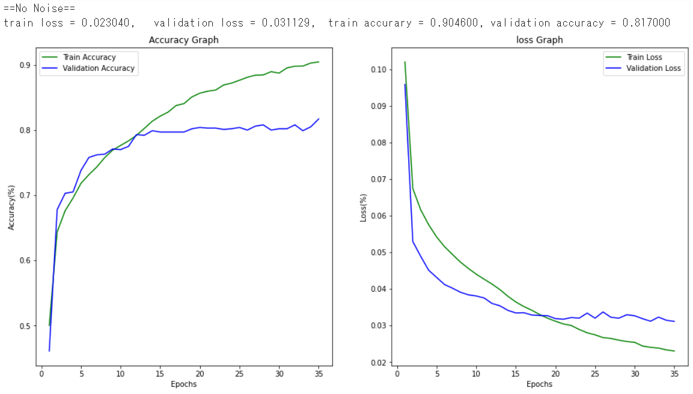
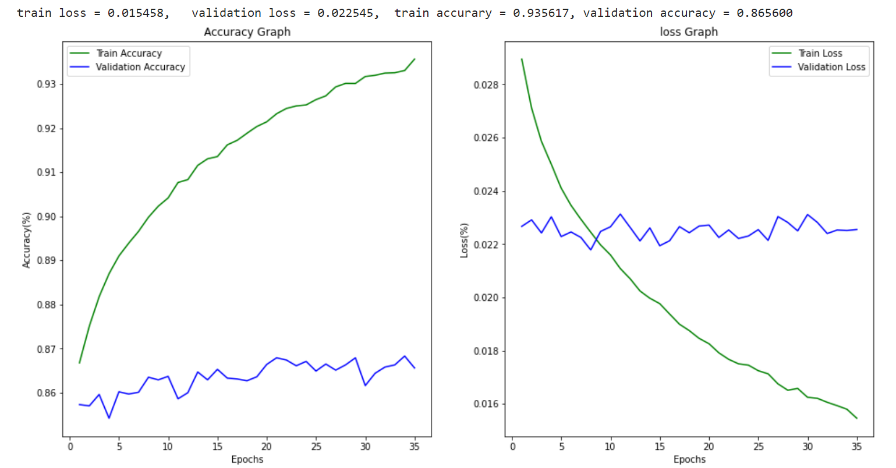
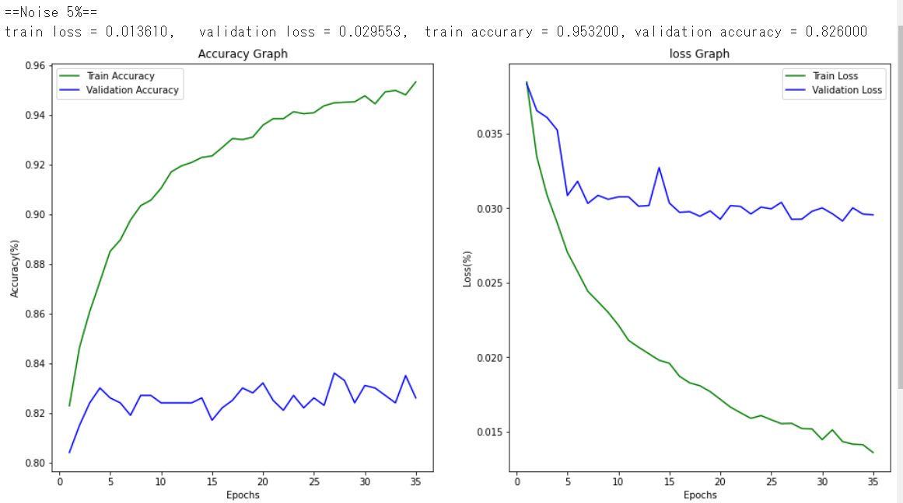
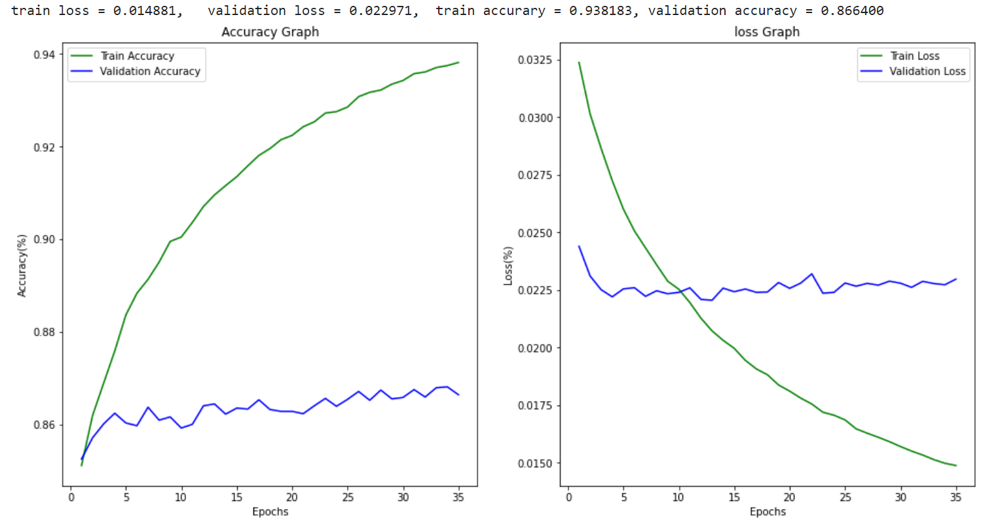
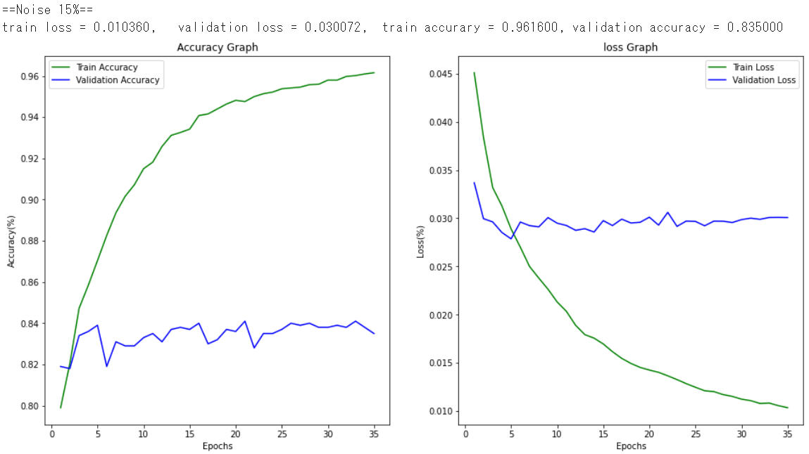
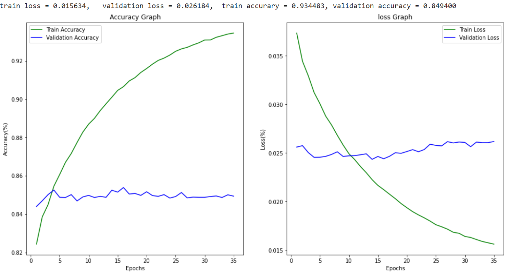
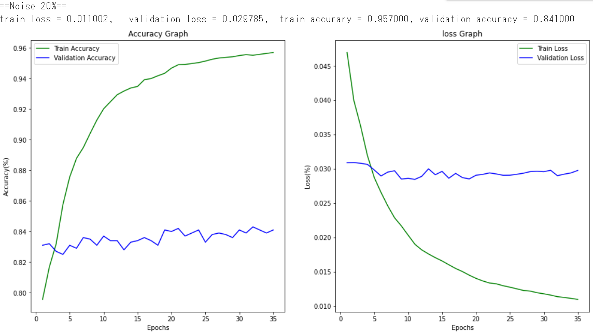
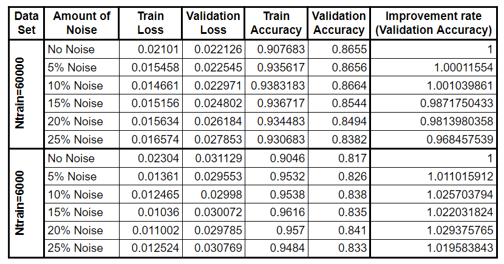
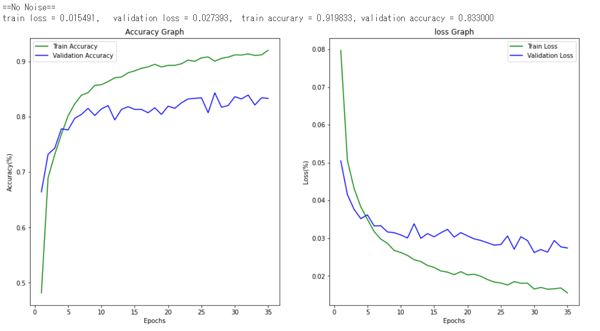

**Robot Intelligence: Report Assignment**

**Introduction**

Feedforward neural networks have achieved impressive results in a variety of tasks, including image classification, language translation, and speech recognition. In this study, we implemented a feedforward neural network, evaluated and observed its performance on an image classification task using the fashion MNIST dataset.

The fashion MNIST dataset consists of 70,000 fashion images, each image with 28x28 pixels in resolution. It is widely used as a benchmark for evaluating the performance of image classification algorithms.

In the following sections, we described the details of the network architecture and training process and present the results of our experiments.

**Prerequisites and Parameters**

The train and test data used in this neural network are from Keras.datasets.fashion_mnist which is a dataset of 70,000 28x28 labeled fashion images;  Ntrain = 60000 and Ntest = 10000. Each pixel has a single pixel value that describes its lightness or darkness, with larger numbers representing darker pixels. The integer for this pixel value ranges from 0 to 255. Each training data come with the images data (28*28 integers values) and the label from 0 to 9 representing each type of picture as follows:

0 T-shirt/top

1 Trouser

2 Pullover

3 Dress

4 Coat

5 Sandal

6 Shirt

7 Sneaker

8 Bag

9 Ankle boot

This data set was imported to the program as follow:

<table>
  <tr>
    <td>( x_train, y_train ), ( x_test, y_test ) = tf.keras.datasets.fashion_mnist.load_data()
x_train, x_test = x_train.astype( 'float32' )/255, x_test.astype( 'float32' )/255</td>
  </tr>
</table>

Since training with 60000 data can take a lot of time, training the neural network will smaller data can shorten the training time. Here, the program allows users to adjust the train and test data set size as follows: 

<table>
  <tr>
    <td>#define size of train and test data
# Due to the run time of Neural network we can adjust the number of train and test data here 
x_train = x_train[:6000]
y_train = y_train[:6000]
x_test = x_test[:1000]
y_test = y_test[:1000] </td>
  </tr>
</table>

The main library used in this program is Numpy, while Tensorflow is applied for the data preparation and preprocessing, ie. load data. To_categorial from TensorFlow.keras is used to encode the label data (0~9) to a one-hot binary vector. For instance, label 3 (category: Dress) will become [0, 0, 0, 1, 0, 0, 0, 0, 0, 0]. 

The neural network in this study is implemented as follows

1. Prepare and preprocess data (Each pixel value is converted to 0~1 floating decimal)

2. Feed the input into the neural network

3. Let the data flow through each layer until we get the output from the last layer

4. Calculate the error from the difference of output and correct label

5. Adjust the parameter (weight and bias) by deducting the derivation of the error with respect to the parameter itself. We used an epoch size of 35 in this report.

6. After the learning is done, test the Neural network with test data

7. Add noise to train data, observe and evaluate the performance of each case

8. Observe the output of the hidden layers and try increasing the number of neurons

The neural network and layers within are implemented with Class(OOP).

<table>
  <tr>
    <td>#implement Layer class to deal with input, output, fp,bp
class Layer:
    def __init__(self):
        self.input = None
        self.output = None

    # computes the output Y of a layer for a given input X
    def forward_propagation(self, input):
        raise NotImplementedError

    # computes dE/dX for a given dE/dY (and update parameters if any)
    def backward_propagation(self, output_error, learning_rate):
        raise NotImplementedError</td>
  </tr>
</table>

**Findings on Related Matters and Unique Features**

** **

This program used the object-oriented program to implement layers and network. The base class *Layer *is for dealing with input, output, forward and backward methods and will be inherited by other classes such as *ActivationLayer* and *FCLayer*(Dense Layer). The class *Network *includes *add *method to append layer, *use *method to set loss function, *predict *method to predict output for given input, *fit *method to train the network, and *see_hidden_layer* to visualize outputs of the hidden layer. This way of implementation allows users to add more layers and train the model easily the same way machine learning libraries like Scikit-Learn, or Keras can do.

The network implemented in this study is a structure of 3 Dense Layers with different input and output shapes and the tanh activation function.

<table>
  <tr>
    <td>net = Network()
net.add(FCLayer(28*28, 100))     # input_shape=(1, 28*28) output_shape=(1, 100)
net.add(ActivationLayer(tanh, tanh_prime))
net.add(FCLayer(100, 50))        # input_shape=(1, 100)   output_shape=(1, 50)
net.add(ActivationLayer(tanh, tanh_prime))
net.add(FCLayer(50, 10))         # input_shape=(1, 50)    output_shape=(1, 10)
net.add(ActivationLayer(tanh, tanh_prime))</td>
  </tr>
</table>

A 5- layer deep neural network was also implemented in this study to compare the performance with its counterpart.

<table>
  <tr>
    <td>#try deeper neural network with 5 layesr
deepnet = Network()
deepnet.add(FCLayer(28*28, 100)) # input_shape=(1, 28*28) output_shape=(1, 100)
deepnet.add(ActivationLayer(tanh, tanh_prime))
deepnet.add(FCLayer(100, 80))  # input_shape=(1, 100) output_shape=(1, 80)
deepnet.add(ActivationLayer(tanh, tanh_prime))
deepnet.add(FCLayer(80, 50))    # input_shape=(1, 80) output_shape=(1, 10)
deepnet.add(ActivationLayer(tanh, tanh_prime))
deepnet.add(FCLayer(50, 30))    # input_shape=(1, 50) output_shape=(1, 30)
deepnet.add(ActivationLayer(tanh, tanh_prime))
deepnet.add(FCLayer(30, 10))    # input_shape=(1, 30) output_shape=(1, 10)
deepnet.add(ActivationLayer(tanh, tanh_prime))</td>
  </tr>
</table>

**

**

**Results**

In this study, we implemented a deep neural network of 3 hidden layers and an output layer trained with 60000 data and test with 10000 data points from the fashion MNIST dataset. Moreover, we added 5%, 10%, 15%, 20%, and 25% of noise to the data set and observed the performance of our network. Then, the effect of noise on the improvement of accuracy was also observed through two different sizes of data sets.

Fig 1. Adding Noise to the Picture 

(From left to right: No Noise, 5%, 10%, 15%, 20%, 25% Noise)

Our results showed that adding a proper amount of noise to train images improved the generalization ability of the network. The network trained with added noise on a full fashion MNIST dataset achieved an accuracy of 86.64%, while the network trained on clean inputs had an accuracy of 86.55%. However, too much noise can also decrease the generalization ability and the accuracy of the network as training data with 25% noise had an accuracy of just 83.82%. This indicates that adding noise can be a useful technique for improving the performance of a neural network but attention should be paid to the amount of noise added.

Moreover, the effect of noise on generalization ability can vary depending on the size of the train data. Here, we compare the generalization ability of noise to two different sizes of train data set(Ntrain); 1) Ntrain = 60000 Ntest = 10000 (full size) and 2) Ntrain = 6000 Ntest = 1000. While the highest accuracy of both data sets is when 10 % noise is added, the accuracy of the smaller data set improves 102.5% more significantly than that of the bigger data set with 1% compared to when no noise is added. 

**1) N****train**** = 60000 N****test**** = 10000                           2) N****train**** = 6000 N****test**** = 1000**

**Accuracy                         Loss                         Accuracy                     Loss**

Clean Data

5% noise

10% noise

15% noise

20% noise

25%Noise

Fig 2. Accuracy and Loss Graph from 1) and 2) datasets with various amounts of noise

Table 1.** **Accuracy and Loss Data from 1) and 2) datasets with various amounts of noise

Next, we observed the output of the hidden layers. The outputs of the hidden layer have only one to five pixels with significantly large values. The rest of the values are relatively small, 0 or close to 0. Thus, we have a sparse and compressed hidden layer version of a fashion image made by hidden layers extracting features of each type, which is further used for classification.

Fig 3. The output images from the first hidden layer.

Lastly, deep neural networks with 5 layers were implemented on dataset 2) Ntrain = 6000 Ntest = 1000 on clean inputs. This deep neural network can achieve an accuracy of 83.3% more than that of the 3 layers model.

Fig 4. Accuracy and Loss graph of 5 layers deep neural network

**Discussion**

In this study, we implemented a feedforward neural network using the MNIST fashion dataset, which consists of 10 types of labels and 28x28 pixel images. Our network was able to achieve high accuracy on the test set, demonstrating its effectiveness in classifying the different fashion items. 

One of the strengths of using the MNIST fashion dataset for this task is the large number of labeled images, which allowed us to train the network on a sufficient amount of data. The 28x28 pixel resolution of the images is also suitable for this task, as it provides enough detail for the network to distinguish between the different fashion items.

However, it is important to note that the performance of the network may not generalize well to other datasets with different types of images or labels. 

So, we also examined the effect of adding noise up to 25% to the inputs of a deep neural network on its performance. Our results showed that adding noise to the inputs up to 10% can improve the generalization ability of the network, as it was able to achieve higher accuracy on the test set compared to the network trained on clean inputs.

It is significant to mention that the appropriate amount of noise to add will depend on the specific task and architecture of the network. Too much noise, in this case, 20-25% noise, may degrade the performance of the network, while too little may not have a significant effect. It is therefore important to carefully tune the level of noise to find the optimal balance.

Then, the outputs of the hidden layers were observed. The purpose of the hidden layer is to extract features from the input data and transform the data into a representation that is more suitable for the task being modeled. For example, in this study that a network is being used for image classification, and the hidden layers may be responsible for extracting features such as edges, corners, and texture patterns from the input image. The hidden layer is an important part of a feedforward neural network, as it allows the network to model complex relationships in the data and make more accurate predictions.

Increasing the number of neurons and layers in a feedforward neural network can improve performance on the task being modeled, but can also increase the risk of overfitting and the computational complexity of the network. It is important to carefully consider the trade-off between the potential benefits of additional neurons and the increased complexity and to use regularization techniques as needed to prevent overfitting. The optimal number of neurons for a particular task will depend on the complexity of the task and the amount of training data available.

Overall, our results demonstrate the effectiveness of using a feedforward neural network for classifying fashion items using the MNIST fashion dataset. Moreover, the results also suggest that adding noise to the inputs of a neural network can be a useful technique for improving its generalization ability, but careful consideration must be given to the amount and type of noise used. Lastly, the number of neurons and layers might help increase the accuracy in the classification task while it might yield some problems such as overfitting or requiring more computing capacity

**Impressions on the class**

This class is really interesting as I get to develop a basic understanding of robot intelligence and neural network. The experience taking this class, so far, is a rewarding and enriching learning experience. These fundamental concepts and algorithms about neural networks and robot intelligence help me gain a deeper understanding of how these technologies work in real life or in a video of robots parkouring. I specifically think that this assignment of deploying deep neural network from scratch without a machine learning library is a challenging hands-on experience and an excellent opportunity to truly understand how basic neural network works.

In my opinion, one of the hardest parts of this class is the concept of embodiment. Even though I didn't understand some parts of it, most of the parts are really interesting and make me want to do research on this field too.

Overall, the experience of taking this class has been beyond expectations with challenging and engaging content that could help me develop a strong foundation in the field of machine learning and AI.

**Citations**

Ambrosio, Johanna, and Mehreen Saeed. "How to Build a Fully Connected Feedforward Neural Network Using Keras and TensorFlow - Blog." *AI Exchange*, 26 May 2022, https://exchange.scale.com/public/blogs/how-to-build-a-fully-connected-feedforward-neural-network-using-keras-and-tensorflow. Accessed 8 January 2023.

"Don't Overfit! — How to prevent Overfitting in your Deep Learning Models." *Towards Data Science*, 5 June 2019, https://towardsdatascience.com/dont-overfit-how-to-prevent-overfitting-in-your-deep-learning-models-63274e552323. Accessed 8 January 2023.

Rath, Sovit Ranjan. "A Practical Guide to Build Robust Deep Neural Networks by Adding Noise." *DebuggerCafe*, 24 February 2020, https://debuggercafe.com/a-practical-guide-to-build-robust-deep-neural-networks-by-adding-noise/. Accessed 8 January 2023.

Schwartz, Mathew. "Neural Network from scratch in Python | by Omar Aflak." *Towards Data Science*, https://towardsdatascience.com/math-neural-network-from-scratch-in-python-d6da9f29ce65. Accessed 8 January 2023.

